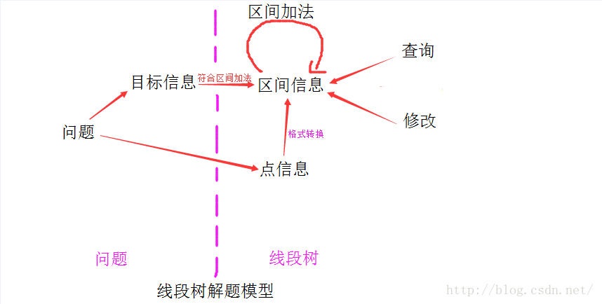

> 本文参考了岩之痕的[线段树从零开始](https://blog.csdn.net/zearot/article/details/52280189)和[线段树详解](https://www.cnblogs.com/AC-King/p/7789013.html)，原理可以在原文细看，本文主要是对线段树的几个例题进行实现，以备复习

## 为什么要用线段树
有这样一个场景，给定一个数组，让求任意区间的累加和。

一般有两种算法
- 将这个区间上的所有数累加，然后返回
- 先求前n项的前缀和，然后将这期间差相减

但是，如果对其中任意一个数据进行操作，就会对累加和的时间复杂度有影响，第一种只需要修改一个元素，第二种却需要将其后的所有前缀和都进行修改。所以第一种查询费时间修改不费时间，第二种查询不费时间修改费时间。线段树就是为了适应修改和统计操作而设计的。

<!-- more -->
## 线段树的原理
线段树的原理，就是，将[1,n]分解成若干特定的子区间(数量不超过4*n),然后，将每个区间[L,R]都分解为
少量特定的子区间，通过对这些少量子区间的修改或者统计，来实现快速对[L,R]的修改或者统计。
> 具体可以参考[线段树详解](https://www.cnblogs.com/AC-King/p/7789013.html)

## 线段树例子
由此看出，用线段树统计的东西，必须符合区间加法，否则，不可能通过分成的子区间来得到[L,R]的统计结果。

符合区间加法的例子：
- 数字之和——总数字之和 = 左区间数字之和 + 右区间数字之和
- 最大公因数(GCD)——总GCD = gcd( 左区间GCD , 右区间GCD );
- 最大值——总最大值=max(左区间最大值，右区间最大值)

不符合区间加法的例子：
- 众数——只知道左右区间的众数，没法求总区间的众数
- 01序列的最长连续零——只知道左右区间的最长连续零，没法知道总的最长连续零

## 线段树的递归模版（区间和模版）
### 定义
``` cpp
// 注意！线段树开始是从1开始的，不是0，否则会导致root<<1不是左节点
vector<int> sum(n << 2, 0); // 统计量
vector<int> add(n << 2, 0); // 惰性标记
```

### 建树
``` cpp
void PushUp(int root, vector<int>& sum) {
    // 向上更新
    sum[rt] = sum[root << 1] + sum[root << 1 | 1]; // 左右值相加
}

void build(int l, int r, int root, vector<int>& nums, vector<int>& sum) {
    if (l == r) {
        sum[root] = nums[l - 1]; // 更新叶子结点
        return;
    }
    int mid = l + (r - l) / 2;
    build(l, m, root << 1, nums, sum); // 更新左右子树
    build(m + 1, r, root << 1 | 1, nums, sum);
    PushUp(root, sum); // 更新统计信息
}
```

### 点修改
nums[index] += c
``` cpp
void Update(int index, int c, int l, int r, int root, vector<int>& sum) {
    if (l == r) {
        sum[root] += c;
        return;
    }
    int mid = l + (r - l) / 2;
    if (index < mid) Update(index, c, l, mid - 1, sum);
    else Update(index, c, mid, r, sum);
    PushUp(root, sum);
}
```

### 区间修改
nums[left, right] += c
``` cpp
// 下推时必须将统计值更新，子树更新时必须将父节点也上推更新，保证数据一致性
void PushDown(int root, int l_cnt, int r_cnt, vector<int>& sum, vector,int>& add) {
    //  下推标记
    add[root << 1] += add[root];
    add[root << 1 | 1] += add[root];

    // 下推统计值
    sum[root << 1] += add[root] * l_cnt;
    sum[root << 1 | 1] += add[root] * r_cnt;

    // 清除标记
    add[root] = 0; 
}

void Update(int left, int right, int c, int l, int r, int root, vector<int>& sum, vector<int>& add) {
    if (left <= l && r <= right) {
        sum[root] += c * (r - l + 1); // 更新统计信息
        add[root] += c; // 更新惰性标记
        return;
    }
    int m = l + (r - l) / 2;
    PushDown(root, m - l + 1, r - m, sum, add); // 在更新新标记的时候将旧标记下推, 分别表示左右子树的更新个数
    if (left <= m) Update(left, right, c, l, m, root << 1, sum, add);
    if (m < right) Update(left, right, c, m + 1, r, root << 1 | 1, sum, add);
    PushUp(root, sum); // 因为只下推了就标记，所以需要更新本节点的统计值
}
```

### 查询区间
``` cpp
int Query(int left, int right, int l, int r, int root, vector<int>& sum, vector<int>& add) {
    // left, right为要查找的区间，l和r表示此函数所在的查询区间
    if (left <= l && r <= right) {
        return sum[root];
    }

    int m = l + (r - l) / 2;
    PushDown(root, m - l + 1, r - m, sum, add);
    
    int ret = 0;
    if (left <= m) ret += Query(left, right, l, m, root << 1, sum, add);
    if (m < right) ret += Query(left, right, m + 1, r, root << 1 | 1, sum, add);
    return ret;
}
```


## 非递归原理和实现
后期更新...

## 线段树思路


## 题目练习
### 区间最大值（头条面试题）
``` cpp
#include <iostream>
#include <vector>
#include <math.h>
#include <climits>

using namespace std;

class segment_tree {
private:
    vector<int> ans;
    vector<int> add;

    void PushUp(int root) {
        ans[root] = max(ans[root << 1], ans[root << 1 | 1]);
    }

    void PushDown(int root) {
        if (!add[root]) return;
        ans[root << 1] += add[root];
        ans[root << 1 | 1] += add[root];
        add[root << 1] += add[root];
        add[root << 1 | 1] += add[root];
        add[root] = 0;
    }

    void build(int root, int l, int r, vector<int>& nums) {
        if (l == r) {
            ans[root] = nums[l - 1];
            return;
        }
        int m = l + (r - l) / 2;
        build(root << 1, l, m, nums);
        build(root << 1 | 1, m + 1, r, nums);
        PushUp(root);
    }

public:
    segment_tree(vector<int>& nums) {
        int n = nums.size();
        ans = vector<int>(n << 2, INT_MIN);
        add = vector<int>(n << 2, 0);
        build(1, 1, n, nums);
    }

    void update(int index, int c, int l, int r, int root) {
        if (l == r) {
            ans[root] += c;
            return;
        }
        // 因为query的时候一定会下推，所以此处不需要下推标记
        int m = l + (r - l) / 2;
        if (index <= m) update(index, c, l, m, root << 1);
        else update(index, c, m + 1, r, root << 1 | 1);
        PushUp(root);
    }

    void update(int L, int R, int c, int l, int r, int root) {
        if (L <= l && r <= R) {
            ans[root] += c;
            add[root] += c;
            return;
        }

        PushDown(root);
        int m = l + (r - l) / 2;
        if (L <= m) update(L, R, c, l, m, root << 1);
        if (m < R) update(L, R, c, m + 1, r, root << 1 | 1);
        PushUp(root);

    }

    int query(int L, int R, int l, int r, int root) {
        if (L <= l && r <= R) {
            return ans[root];
        }
        PushDown(root);
        int m = l + (r - l) / 2;
        int ret = INT_MIN;
        if (L <= m) ret = max(ret, query(L, R, l, m, root << 1));
        if (m < R) ret = max(ret, query(L, R, m + 1, r, root << 1 | 1));
        return ret;
    }
};

int main() {
    int n;
    cin >> n;
    
    vector<int> nums(n, 0);
    for (int i = 0; i < n; i++) {
        cin >> nums[i];
    }

    segment_tree* inst = new segment_tree(nums);

    int t;
    cin >> t;
    for (int i = 0; i < t; i++) {
        int x, y, c;
        cin >> x >> y >> c;
        if (x == y) inst->update(x, c, 1, n, 1);
        else {
            inst->update(x, y, c, 1, n, 1);
        for (int j = 1; j <= n; j++)
        cout << inst->query(j, j, 1, n, 1) << " ";
        cout << endl;
        }
    }

    return 0;
}
```

### 区间和
``` cpp
// 2019-04-13
#include <iostream>
#include <vector>

using namespace std;
class segment_tree {
private:
    vector<int> sum;
    vector<int> add;
    void PushUp(int root) {
        sum[root] = sum[root << 1] + sum[root << 1 | 1];
    }

    void build(vector<int>& nums, int l, int r, int root) {
        if (l == r) {
            sum[root] = nums[l - 1];
            return; 
        }

        int m = l + (r - l) / 2;
        build(nums, l, m, root << 1);
        build(nums, m + 1, r, root << 1 |1);
        PushUp(root);
    }
    void PushDown(int root, int cnt_l, int cnt_r) {
        if (add[root]) {
            sum[root << 1] += add[root] * cnt_l;
            sum[root << 1 | 1] += add[root] * cnt_r;
            add[root << 1] += add[root];
            add[root << 1| 1] += add[root];
            add[root] = 0;
        }
    }
public:
    segment_tree(vector<int>& nums) {
        int n = nums.size();
        sum = vector<int>(n << 2, 0);
        add = vector<int>(n << 2, 0);
        build(nums, 1, n, 1);
    }
    void Update(int L, int R, int c, int l, int r, int root) {
        // 更新是加c到L..R
        cout << l << " " << r << endl;
        if (L <= l && r <= R) {
            sum[root] += c * (r - l + 1);
            add[root] += c;
            return;
        }

        int m = l + (r - l) / 2;
        PushDown(root, m - l + 1, r - m);
        if (L <= m) Update(L, R, c, l, m, root << 1);
        if (m < R) Update(L, R, c, m + 1, r, root << 1 | 1);
        PushUp(root);
    }
    void Update(int index, int c, int l, int r, int root) {
        if (l == r) {
            sum[root] += c;
            return;
        }
        int m = l + (r - l) / 2;
        if (index <= m) Update(index, c, l, m, root << 1);
        else Update(index, c, m + 1, r, root << 1 | 1);
        PushUp(root);
    }
    int query(int L, int R, int l, int r, int root) {
        if (L <= l && r <= R) {
            return sum[root];
        }

        int ret = 0;
        int m = l + (r - l) / 2;
        PushDown(root, m - l + 1, r - m);
        if (L <= m) ret += query(L, R, l, m, root << 1);
        if (m < R) ret += query(L, R, m + 1, r, root << 1 | 1);
        return ret;

    }

};


int main() {
    int n;
    cin >> n;
    vector<int> nums(n, 0);
    for (int i = 0; i < n; i++) {
        cin >> nums[i];
    }
    auto instance = new segment_tree(nums);
    
    int t;
    cin >> t;
    for (int i = 0; i < t; i++) {
        for (int j = 1; j <= n; j++) {
            cout << instance->query(j, j, 1, n, 1) << " ";
        }
        cout << endl;
        int x, y, c;
        cin >> x >> y >> c;
        if (x == y) {
            instance->Update(x, c, 1, n, 1);
        }
        else {
            instance->Update(x, y, c, 1, n, 1);
        }
    }

    return 0;
}
```

### 最大公因数
> 因为最大公因数对于加减没有惰性标记代表性，所以这里采用乘除作为update的参数

> update(L,R, c, l, r, root)代表给L到R的所有数都乘以c

``` cpp
// 2019-04-13
#include <iostream>
#include <vector>
#include <math.h>

using namespace std;

class segment_tree {
private:
    vector<int> ans;
    vector<int> mul;
    int GCD(int a, int b) {
        if (!b) return a;
        else return GCD(b, a % b);
    }
    void PushUp(int root) {
        ans[root] = GCD(ans[root << 1], ans[root << 1 | 1]);
    }
    void PushDown(int root) {
        if (mul[root] != 1) {
            ans[root << 1] *= mul[root];
            ans[root << 1 | 1] *= mul[root];
            mul[root << 1] *= mul[root];
            mul[root << 1 | 1] *= mul[root];
            mul[root] = 1;
        }
    }
    void build(vector<int>& nums, int l, int r, int root) {
        if (l == r) {
            ans[root] = nums[l - 1];
            return;
        }
        int m = l + (r - l) / 2;
        if (l <= m) build(nums, l, m, root << 1);
        if (m < r) build(nums, m + 1, r, root << 1 | 1);
        PushUp(root);
    }

public:
    segment_tree(vector<int>& nums) {
        int n = nums.size();
        // 根据不同问题要注意区间值的初始化问题，因为防止没有叶子导致上推引入异常值
        // 因为GCD算法会判断!b，所以将初始值初始化为0可以直接返回a,
        // 这样上推可以直接调用GCD(ans[root << 1], ans[root << 1 | 1])
        ans = vector<int>(n << 2, 0);
        mul = vector<int>(n << 2, 1);
        build(nums, 1, n, 1);
    }
    void Update(int L, int R, int c, int l, int r, int root) {
        if (L <= l && r <= R) {
            ans[root] *= c;
            mul[root] *= c;
            return;
        }
        PushDown(root);
        int m = l + (r - l) / 2;
        if (L <= m) Update(L, R, c, l, m, root << 1);
        if (m < R) Update(L, R, c, m + 1, r, root << 1 | 1);
        PushUp(root);
    }
    void Update(int index, int c, int l, int r, int root) {
        if (l == r) {
            ans[root] *= c;
            return;
        }
        int m = l + (r - l) / 2;
        if (index <= m) Update(index, c, l, m, root << 1);
        else Update(index, c, m + 1, r, root << 1 | 1);
        PushUp(root);
    }
    int Query(int L, int R, int l, int r, int root) {
        if (L <= l && r <= R) {
            return ans[root];
        }
        PushDown(root);
        int ret = 0;
        int m = l + (r - l) / 2;
        if (L <= m) ret = GCD(ret, Query(L, R, l, m, root << 1));
        if (m < R) ret = GCD(ret, Query(L, R, m + 1, r, root << 1 | 1));
        return ret;
    }
};

int main() {
    int n;
    cin >> n;
    
    vector<int> nums(n, 0);
    for (int i = 0; i < n; i++) {
        cin >> nums[i];
    }
    auto instance = new segment_tree(nums);
    
    int t;
    cin >> t;
    for (auto i = 0; i < t; i++) {
        int x, y, c;
        cin >> x >> y >> c;
        if (x == y) {
            instance->Update(x, c, 1, n, 1);
        }
        else {
            instance->Update(x, y, c, 1, n, 1);
        }
        cin >> x >> y;
        cout << instance->Query(x, y, 1, n, 1) << endl;
    }

    return 0;
}
```

### 字符串哈希
待补充。。。

## 最长连续零
待补充。。。

## 计数排序
待补充。。。

## 扫描线
待补充。。。


